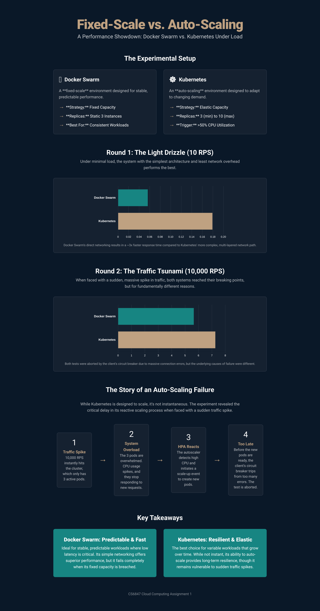

# CS6847: Cloud Computing Assignment 1 - Report

**Name:** Pranav Krishnakant Yadav
**Roll Number:** CE21B097

---

## 1. Introduction and Objective

The primary objective of this assignment is to conduct a practical performance comparison between two distinct container orchestration models: a fixed-scale system and an auto-scaling system. This was achieved by deploying a CPU-intensive server application on both **Docker Swarm** (configured with a fixed number of 3 replicas) and **Kubernetes** (configured to auto-scale from a minimum of 3 to a maximum of 10 replicas).

A custom client was developed to subject both environments to varying request loads, from low (10 RPS) to extreme (10,000 RPS). This report analyzes the resulting server response times to understand the benefits, trade-offs, and performance characteristics of each architectural approach. A key goal is to observe the real-world implications of auto-scaling, particularly its effectiveness and limitations when faced with both steady and sudden high-stress conditions. By analyzing the collected performance data, this report identifies the parameters responsible for variations in response time and provides a detailed analysis of the underlying causes.

---

## 2. System Design and Architecture

### 2.1. Server Application
The server is a Python Flask application designed to simulate a CPU-intensive workload. Upon receiving a GET request, it calculates all prime numbers up to 15,000. This task is computationally bound, making it an ideal metric for testing CPU-based auto-scaling. The application is containerized using a `Dockerfile` for portability and consistent deployment across both platforms.

### 2.2. Client Application
The client is a Python script utilizing `asyncio` and `aiohttp` to generate high-volume, concurrent traffic. Its key features include:
-   **Configurable Load:** The client can be configured to send a specific number of requests per second (RPS) via command-line arguments.
-   **Circuit Breaker:** To handle server unavailability under extreme load, a circuit breaker mechanism was implemented. If 100 consecutive requests fail (due to connection errors or timeouts), the client aborts the test to prevent an indefinite hang.
-   **Automated Data Logging:** For each test, the client records the response time of every individual request into a dedicated log file and generates a cumulative `Output.txt` summary file.

### 2.3. Deployment Architectures

**A. Docker Swarm (Fixed-Scale Architecture)**
The Docker Swarm environment represents a statically provisioned, fixed-capacity system. This setup serves as our baseline for performance without elastic scaling.

-   **Configuration:** The server was deployed as a Docker service with a static, unchanging replica count of **3**.
-   **Load Balancing:** Docker Swarm's built-in routing mesh was used to handle load balancing, distributing incoming requests evenly across the three running container instances.

*Figure 1: Docker Swarm Fixed-Scale Architecture*
```text
+---------------------------------+
|      Client (External User)     |
+---------------------------------+
                |
                v (Requests to Host IP:5001)
+---------------------------------+
|         Docker Host Node        |
|    (Swarm Routing Mesh Entry)   |
|                                 |
|   +-----------+  +-----------+  |
|   | Replica 1 |  | Replica 2 | ... (3 Total)
|   +-----------+  +-----------+  |
+---------------------------------+
````

**B. Kubernetes (Auto-Scaling Architecture)**
The Kubernetes environment represents a modern, elastic, auto-scaling system capable of reacting to changes in load.

  - **Configuration:** The server was deployed using a `Deployment` object with an initial replica count of **3**.
  - **Auto-Scaling:** A `HorizontalPodAutoscaler` (HPA) resource was configured to monitor the average CPU utilization of the pods.
      - **Minimum Replicas:** 3
      - **Maximum Replicas:** 10
      - **CPU Target:** 50% Utilization
  - **Networking:** A `NodePort` service was used and exposed to the local network via the `kubectl port-forward` command to ensure stable, external accessibility.

*Figure 2: Kubernetes Auto-Scaling Architecture*

```text
+---------------------------------+
|      Client (External User)     |
+---------------------------------+
                |
                v (Requests to Host IP:5002)
+-----------------------------------+
|          Kubernetes Node          |
|    (kubectl port-forward)         |
|                                   |
|      +------------------+         |
|      | Kubernetes Svc   |         |
|      +------------------+         |
|      |         |        |         |
|  +------+   +---+---+   +------+  |
|  | Pod 1|   | Pod 2 |   | Pod 3| ... (Scales up to 10)
|  +------+   +---+---+   +------+  |
+-----------------------------------+
```

-----

## 3\. Experimental Results & Analysis

Tests were conducted at 10, 100, 1000, and 10,000 RPS against both environments. The average response times for successful requests are summarized below.

### 3.1. Summary of Results

| Environment  | Request Rate (RPS) | Average Response Time (seconds) | Outcome                                  |
| :----------- | :------------------- | :------------------------------ | :--------------------------------------- |
| Docker Swarm | 10                   | **0.0569** | Stable Performance                       |
| Docker Swarm | 100                  | 1.2901                          | Significant Latency Increase             |
| Docker Swarm | 1000                 | 4.0607                          | System Heavily Saturated                 |
| Docker Swarm | 10000                | 5.7032                          | Failure (Circuit Breaker Tripped)        |
| Kubernetes   | 10                   | 0.1807                          | Stable Performance                       |
| Kubernetes   | 100                  | 5.3287                          | High Latency, System Struggling        |
| Kubernetes   | 1000                 | 7.4251                          | Failure (Circuit Breaker Tripped)        |
| Kubernetes   | 10000                | 7.3213                          | Failure (Circuit Breaker Tripped)        |

### 3.2. Performance Plot

*Figure 3: Comparison of Average Response Times (in seconds) across different loads. A lower bar indicates better performance.*
```text
Check the visualisation at the end of this report
```

### 3.3. Detailed Analysis

**A. Low Load Performance (10 RPS)**

At a minimal load, the **Docker Swarm** environment was significantly more performant, with an average response time of **56.9 ms** compared to Kubernetes' **180.7 ms**. This \~3.2x difference is primarily due to the added network complexity in the Kubernetes setup. Requests to the Kubernetes service must traverse the `kubectl port-forward` tunnel and the internal service proxy, each adding a small but measurable amount of latency. At this low volume, the computational load is trivial for both systems, making network overhead the dominant performance factor.

**B. High Load Performance (10,000 RPS)**

As the request rate was increased to 10,000 RPS, both systems were pushed to their breaking points, but they failed for different and insightful reasons.

  * **Docker Swarm (Fixed Capacity Failure):**
    With its fixed capacity of 3 replicas, Docker Swarm's performance degraded rapidly as the load increased. At 10,000 RPS, the system was immediately overwhelmed. The raw log file (`Docker_response_10000.txt`) shows that after an initial period of very high latency (requests taking 5-10 seconds), the server became completely unresponsive, leading to a stream of `CONNECTION_ERROR` messages that ultimately tripped the client's circuit breaker. This is a classic failure mode for a fixed-scale system where demand drastically exceeds the provisioned capacity.

  * **Kubernetes (The Auto-Scaling Delay):**
    The Kubernetes environment also failed under the 10,000 RPS load, but the reason for its failure is the key finding of this experiment. The failure demonstrates the concept of **reactive auto-scaling delay** and **network latency**. The reactive auto-scaling delay process is as follows:

    1.  **Initial Overload:** The test instantly flooded the initial **3 pods** with 10,000 requests. These pods were immediately saturated, causing their CPU utilization to spike well beyond the 50% target.
    2.  **HPA Reaction:** The Horizontal Pod Autoscaler (HPA) correctly detected this spike and initiated a scale-up event. The HPA log from the experiment confirms this behavior, showing the CPU `TARGETS` increasing, which triggers the scaling logic. The system attempted to scale up to handle the load.
    3.  **The Scaling Delay:** This is the critical phase. Scaling up is not instantaneous. Kubernetes requires time to schedule new pods, pull the container image, start the containers, and run health checks. This process can take 20-60 seconds.
    4.  **Client Timeout:** During this crucial delay, the original 3 pods remained overwhelmed and unresponsive. The client, facing a wall of connection errors, tripped its circuit breaker and aborted the test *long before* the new, scaled-up pods could come online to help with the load.

    The very high average response time of **7.3 seconds** for Kubernetes reflects the extreme latency experienced by the initial 3 pods just before they became completely unresponsive. The overall high latency of kubernetes compared to docker swarm comes as counter-intuitive in the experiment but it makes complete sense when you understand what's happening:

    1. The client connects almost directly to the docker swarm service, which runs on Docker's simple and efficient internal network.
    2. Kubernetes (via Minikube): The connection has to go through several extra layers of networking abstraction.
    3. Each of these layers adds a tiny amount of latency. At only 10 requests per second, this small, fixed overhead becomes noticeable, making the average response time slightly higher overall for kubernetes. Added the reactive delay on top of that makes it seem like kubernetes is the worse option here but for larger systems where the network overhead is the same, it's better to deploy your containers in kubernetes clusters and not docker swarm. 

    I was monitoring the hpa using this command: `kubectl get hpa -w` and this is what I got while I was sending 10000 rps to the kubernetes pods

    |      NAME    | REFERENCE   |  TARGETS | MINPODS | MAXPODS | REPLICAS | AGE |
    | :----------- | :---------- | :------- | :-------| :-------| :--------| :-- |
    | cpu-loader-hpa | Deployment/cpu-loader-deployment| cpu: 21%/50%| 3 |10 |3 |15h|
    | cpu-loader-hpa | Deployment/cpu-loader-deployment| cpu: 85%/50%| 3 |10 |3 |15h|
    | cpu-loader-hpa | Deployment/cpu-loader-deployment| cpu: 85%/50%| 3 |10 |6 |15h|
    | cpu-loader-hpa | Deployment/cpu-loader-deployment| cpu: 0%/50%| 3 |10 |6 |15h|
    

## 4\. Conclusion

This experiment successfully highlights the fundamental trade-offs between fixed-scale and auto-scaling architectures in a cloud computing context. Especially when the clusters are deployed locally using docker desktop and minikube.

1.  **Fixed-Scale (Docker Swarm):** This architecture offers lower latency and better performance for predictable, low-volume workloads due to its simpler networking model. However, it lacks resilience and fails completely when its static capacity is exceeded, demonstrating the primary weakness of fixed-scale systems.

2.  **Auto-Scaling (Kubernetes):** This architecture provides the elasticity and resilience necessary to handle variable or growing traffic loads over time. While it successfully detected the need to scale, its **reactive nature** introduces a critical delay. This makes it vulnerable to sudden, extreme traffic spikes that occur faster than its scaling response time. The system can be overwhelmed before it has a chance to provision the additional resources it needs.

In conclusion, the choice of architecture is highly dependent on the expected workload. For applications with stable and predictable traffic, a fixed-scale system can be more efficient. For applications expecting variable or high-growth traffic, an auto-scaling system like Kubernetes is superior, though strategies like pre-warming or more aggressive scaling triggers may be needed to mitigate the impact of very sudden load spikes.

# Visualising the results



