# Performance Analysis Report: Docker Swarm (Static Scaling) vs. Kubernetes (Dynamic Autoscaling)

**Student:** Pranav Yadav
**Roll Number:** CE21B097
**Course:** CS6847 - Cloud Computing

---

## 1. Objective

The primary objective of this experiment is to observe, compare, and analyze the performance characteristics of a containerized application under two distinct orchestration strategies. Specifically, I aim to contrast the behavior of a **statically scaled Docker Swarm service** against a **dynamically autoscaled Kubernetes deployment**. The goal is to understand the trade-offs between a fixed-capacity system and an elastic one when subjected to both low and high request loads, focusing on response time, scalability, and system resilience.

---

## 2. System Architecture

The experiment is built around a client-server model where the server environments are containerized and orchestrated, and a client generates load.

### 2.1 Core Application Components
* **Server (`server.py`)**: A lightweight Python Flask application with a single API endpoint `/reverse`. It accepts a JSON POST request containing a string and returns the reversed string.
* **Container (`Dockerfile`)**: The Flask server is packaged into a Docker image named `string-reverser:v1` using a slim Python base image to ensure efficiency and fast startup times.

### 2.2 Orchestration Environment 1: Docker Swarm (Static Scaling)

This environment represents a simple, fixed-capacity setup. The architecture is straightforward:

* **Configuration**: The application is deployed as a Docker Swarm service with a constant replica count of **3**.
* **Networking & Load Balancing**: Docker's native ingress routing mesh exposes the service on port `5001` of the host machine. It automatically load balances incoming requests in a round-robin fashion across the three running container replicas.

```mermaid
graph TD
    %% Define the external client that initiates requests.
    Client["<font size=5>👨‍💻</font><br><b>Client Machine</b>"]

    %% Group all server-side components within the Host Machine boundary.
    subgraph "Server Host Machine"
        style Host fill:#f0f8ff,stroke:#0047AB,stroke-width:2px,stroke-dasharray: 5 5
        
        %% The Ingress Mesh acts as the single entry point and load balancer.
        IngressMesh["<font size=7>🌐</font><br><b>Docker Ingress Routing Mesh</b><br><i>L4 Load Balancer on Port 5001</i>"]
        style IngressMesh fill:#e3f2fd,stroke:#0047AB
        
        %% The service consists of a fixed set of three container replicas.
        subgraph "Fixed Replica Set (x3)"
            direction LR
            R1["<font size=5>🐍</font><br><b>Replica 1</b><br><i>string-reverser:v1</i>"]
            R2["<font size=5>🐍</font><br><b>Replica 2</b><br><i>string-reverser:v1</i>"]
            R3["<font size=5>🐍</font><br><b>Replica 3</b><br><i>string-reverser:v1</i>"]
        end
    end

    %% Define the flow of traffic from the client to the replicas.
    Client -- "HTTP Requests" --> IngressMesh
    IngressMesh -- "Distributes Traffic" --> R1
    IngressMesh -- "Distributes Traffic" --> R2
    IngressMesh -- "Distributes Traffic" --> R3
    
    %% Define CSS-like classes for consistent styling.
    classDef replica fill:#fff9c4,stroke:#f57f17
    class R1,R2,R3 replica
```

### 2.3 Orchestration Environment 2: Kubernetes (Dynamic Autoscaling)

This environment is a more complex, multi-component setup designed to demonstrate elasticity and resilience under load.

* **Deployment (`deployment.yaml`)**: Manages the application pods, starting with a baseline of **3 replicas**. It defines CPU resource `requests` ("200m"), which acts as a baseline for scheduling, and `limits` ("500m"), the maximum CPU a pod can consume. The `requests` value is the metric the autoscaler monitors.
* **Service (`service.yaml`)**: A `NodePort` service acts as a stable internal endpoint and load balancer for the pods. It abstracts the pod IPs, providing a single DNS name for traffic.
* **Horizontal Pod Autoscaler (HPA) (`hpa.yaml`)**: This is the brain of the autoscaling logic. It is configured to monitor the average CPU utilization of the pods. If the average load exceeds **50%**, the HPA automatically provisions new pods, scaling up to a maximum of **10 replicas**.
* **Networking**: The service is exposed to the local network using the `kubectl port-forward` command, which tunnels traffic from port `5002` on the host machine to the internal Kubernetes service.

---

## 3. Methodology

The experiment was conducted by executing an automated test suite from the `client.py` script against the two server environments deployed on a local Windows machine running Docker Desktop. The four distinct test cases were:
1.  **Docker Swarm - Low Load**: 10 sequential requests.
2.  **Kubernetes - Low Load**: 10 sequential requests.
3.  **Docker Swarm - High Load**: 10,000 concurrent requests.
4.  **Kubernetes - High Load**: 10,000 concurrent requests.

During the high-load Kubernetes test, the HPA's status was actively monitored in a separate terminal using `kubectl get hpa -w` to observe the scaling behavior in real-time.

---

## 4. Results

The automated client script produced the following average response times across the four tests.

### 4.1 Performance Metrics Summary

| Orchestrator | Load (Requests) | Average Response Time (s) |
| :----------- | :-------------- | :------------------------ |
| Docker Swarm | 10              | 0.0120                    |
| Kubernetes   | 10              | 0.0176                    |
| Docker Swarm | 10,000          | **4.2365** |
| Kubernetes   | 10,000          | 10.5178                   |

### 4.2 Performance Visualization

### 4.3 Kubernetes HPA Scaling Event Log

The real-time monitoring of the HPA during the 10,000-request test revealed the following sequence of events:

| Timestamp (Approx.) | CPU Utilization (Target: 50%) | Replicas (Min: 3, Max: 10) | Event                       |
| :------------------ | :---------------------------- | :------------------------- | :-------------------------- |
| T + 18s             | `<unknown>`                   | 0 -> 3                     | Pods Initializing           |
| T + 60s             | **81%** / 50%                 | 3                          | **CPU Target Breached** |
| T + 2m              | 0% / 50%                      | **3 -> 5** | **Scaling Event Triggered** |
| T + 6m              | 0% / 50%                      | 5                          | System Stabilized           |

This log clearly shows the CPU utilization spiking to 81%, well above the 50% target, which subsequently triggered the HPA to scale the deployment up from 3 to 5 pods.

---

## 5. Analysis and Interpretation

The results present a fascinating and initially counter-intuitive outcome: the more advanced, autoscaling Kubernetes setup was **more than twice as slow** as the static Docker Swarm setup under high load. This is not an indication of failure, but rather a clear illustration of the inherent costs and mechanics of reactive autoscaling.

### 5.1 Low Load Performance (10 Requests)

Under negligible load, both systems performed almost identically. The minor additional latency in the Kubernetes test (5.6ms) is attributable to its more complex networking stack. Traffic had to pass through the `kubectl port-forward` user-space process and the internal service proxying layer, compared to Docker Swarm's more direct kernel-level ingress mesh. This overhead is insignificant for light traffic.

### 5.2 High Load Performance (10,000 Requests)

#### Docker Swarm: Raw Speed and Simplicity
Docker Swarm's performance of **4.24s** is a measure of the raw throughput of its three fixed replicas. With no scaling logic, its performance is simple and predictable: the three workers process the queue of 10,000 requests as fast as their CPU allows. It is fast but brittle; a sustained load would have seen response times continue to degrade with no hope of automated recovery.

#### Kubernetes: The Cost of Elasticity
The Kubernetes result of **10.52s** does not measure the application's speed; it measures the **duration of the entire reactive scaling feedback loop**. The higher average response time is a direct consequence of the system absorbing a massive load *before* it could adapt.

Let's break down the timeline of the Kubernetes high-load test:

The crucial insight is that the **average response time is calculated across all four of these phases**. The initial period of overload, where 3 pods struggled to do the work of 5 or more, contributes heavily to the poor average.

Furthermore, a significant confounding factor was the use of `kubectl port-forward`. This tool is designed for debugging, not for high-throughput traffic. During the test, I observed a stream of `wsarecv: An existing connection was forcibly closed` errors. This indicates that the **`port-forward` process itself became a network bottleneck**, unable to handle the thousands of concurrent connections. It was dropping requests, which likely caused the client to retry, further inflating the total time and degrading performance.

---

## 6. Conclusion

This experiment successfully highlights the fundamental trade-off between static and dynamic container orchestration.

* **Docker Swarm** demonstrated superior raw performance in a short, high-intensity burst. Its simplicity and lower-level networking resulted in less overhead. This makes it a viable choice for applications with highly predictable and stable workloads where raw speed is the primary concern.

* **Kubernetes**, while appearing "slower" in this specific benchmark, proved its core value proposition: **resilience and automated adaptability**. The higher average response time was not a failure of the application but a transparent cost of the reactive scaling process. In a real-world scenario with fluctuating traffic, this ability to automatically provision and de-provision resources to match demand is invaluable for maintaining service level objectives (SLOs) and optimizing cost. The experiment clearly shows that Kubernetes prioritizes long-term stability and automated resource management over the lowest possible latency *during* a scaling event.

Ultimately, the results are not an indictment of Kubernetes's performance, but rather a practical demonstration of its design philosophy. For any dynamic, mission-critical application, accepting a temporary, controlled performance degradation while the system scales is a necessary and worthwhile price to pay for ensuring the application remains available and responsive in the long run.